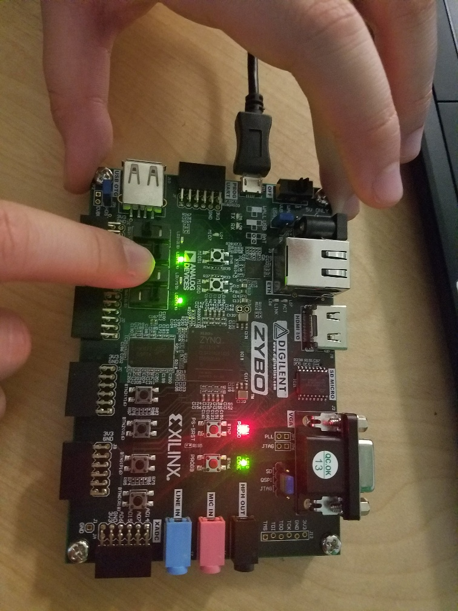
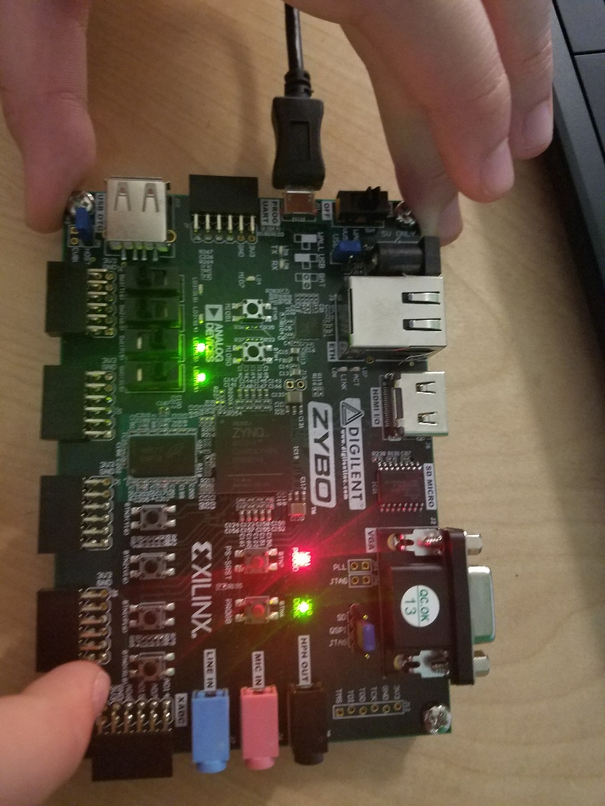
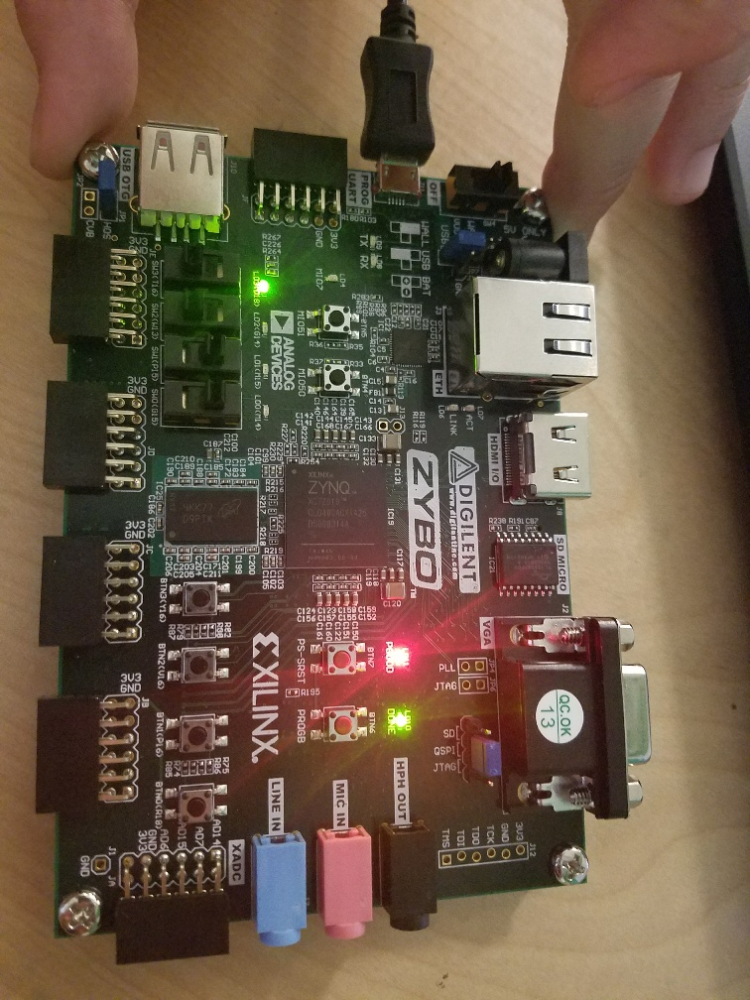
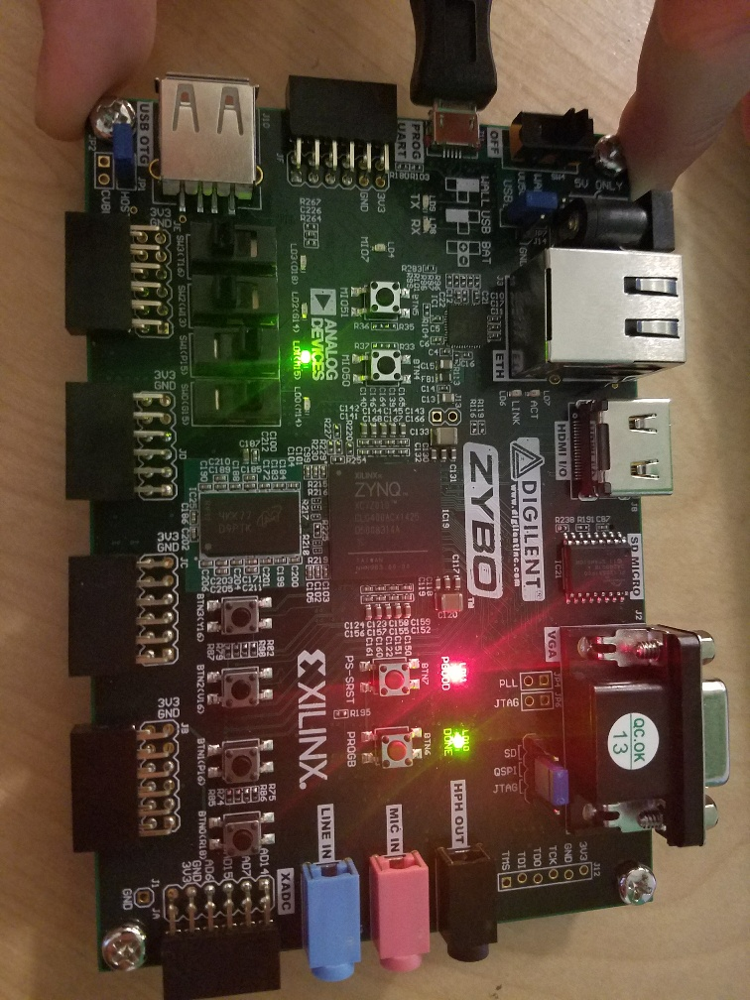
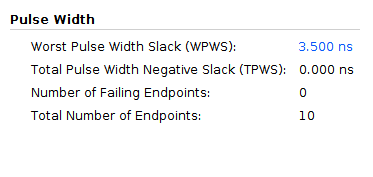
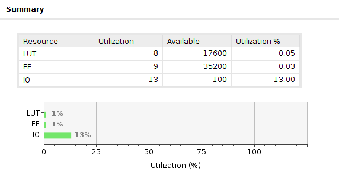

# Lab 0 Report

### Kaitlyn Keil and Serena Chen

## Timing

This is our waveform of all 16 test cases.

This is our waveform for one test case, as marked by the markers. No matter the inputs, it will always take 
350 time units to propogate (given a constant 50 time units per gate). This is significantly faster than if we had decided to use AND gates, such as was demonstrated in class. Instead, we used XOR gates to minimize the steps to completion.

## Verilog Tests

This is the output for our test cases. We tried to test as many edge cases as possible, such as large negatives, large positives, adding negatives and positives, adding 0s and 1s, and various overflow scenarios. We started with the four cases in the in-class slides as a sanity check and to examine different overflow cases. From there, we went with a few base cases (0000+0000, 1111+1111) and other cases that seemed like they could cause issues (1111+0001, leading to (1)0000). The rest we filled with a variety of random cases.

In terms of test cases failure, throughout the process of building the four bit adder, we had one failure, and that was due to the test case being incorrect (we checked on paper!).

## FPGA Results

We chose to represent the second item on our truth table (truth table above):

a: 0101

b: 0011

expected sum: 1000

expected overflow: 1

expected carryout: 0

The above pictures show a and b.

This shows the sum for a and b. As we expect, it is 1000.

This shows the values for overflow and carryout, in that order. As we expect, overflow is 1 and carryout is 0.

We also ran our other tests from the truth table on the FPGA, and they were successful.

## Vivado Resources

Vivado's analysis of the circuit timing aligns with our waveform above--if each time unit is 0.01 ns, then the worst case will be 3500 ns.

The resources show that we have used very few look up tables and flip flops, and that most of the resources being utilized is in IO (buttons, switches, etc.).