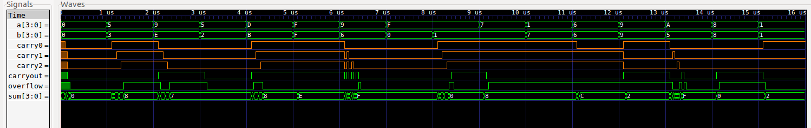
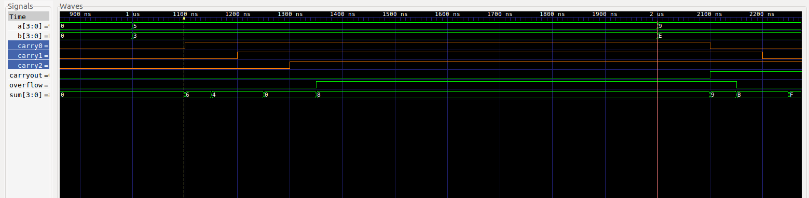
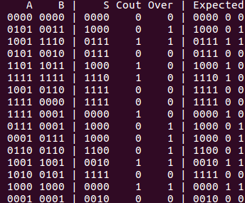

# Lab 0 Report

### Kaitlyn Keil and Serena Chen

This is our waveform of all 16 test cases.

This is our waveform for one test case, as marked by the markers. No matter the inputs, it will always take 
350 time units to propogate (given a constant 50 time units per gate). This is significantly faster than if we had decided to use AND gates, such as was demonstrated in class. Instead, we used XOR gates to minimize the steps to completion.

This is the output for our test cases. We tried to test as many edge cases as possible, such as large negatives, large positives, adding negatives and positives, adding 0s and 1s, and various overflow scenarios. We started with the four cases in the in-class slides as a sanity check and to examine different overflow cases. From there, we went with a few base cases (0000+0000, 1111+1111) and other cases that seemed like they could cause issues (1111+0001, leading to (1)0000). The rest we filled with a variety of random cases.

In terms of test cases failure, throughout the process of building the four bit adder, we had one failure, and that was due to the test case being incorrect (we checked on paper!).

Our main troubles came from connecting with the FPGA board.